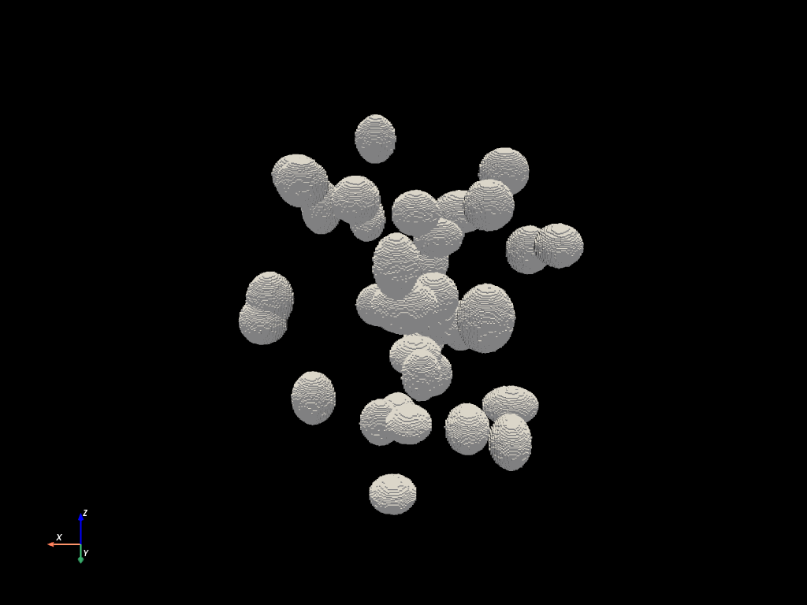

# IMPPY3D (v1.1.0)

Image Processing in Python for 3D image stacks.

## Description
Image Processing in Python for 3D image stacks, or IMPPY3D, is a software
repository comprising mostly Python scripts that simplify post-processing and
3D shape characterization of grayscale image stacks, otherwise known as
volume-based images, 3D images, or voxel models. IMPPY3D was originally created
for post-processing image stacks generated from X-ray computed tomography
measurements. However, IMPPY3D also contains a functions to aid in
post-processing general 2D/3D images. 

Python was chosen for this library because of it is a productive, easy-to-use
language. However, for computationally intense calculations, compiled codes and
libraries are used for improved performance, such as well known libraries like
Numpy and SciKit-Image. Compiled libraries internal to IMPPY3D were created
using Cython. IMPPY3D was developed in an Anaconda environment with Windows 10
and Linux in mind, and suitable Anaconda environment files for these operating
systems are provided to simplify the process of installing the necessary
dependencies although some dependancy resolution may still be required. 

Some of the highlighted capabilies of IMPPY3D include: interactive graphical
user-interfaces (GUIs) available for many image processing functions, various
2D/3D image filters (e.g., blurring, sharpening, denoising, erosion/dilation),
the ability to segment and label continuous 3D objects, precisely rotating an
image stack in 3D and re-slicing along the new Z-axis, multiple algorithms
available for fitting rotated bounding boxes to continuous voxel objects, image
stacks can be converted into 3D voxel models suitable for viewing in ParaView,
and voxel models can be represented as smooth surface-based models like STL
meshes. Additional information and example scripts can be found in the included
ReadMe files.

## Example of Post-Processing an X-ray CT Image Stack
Synthetic X-ray computed tomography (X-ray CT) images can be created. To do so
run the "./resources/generate_sample_data.py" script, after follwoing the setup
instructions. Some examples may have been downloaded as part of the code, these
are found in the "./examples/resources/powder_particles/" directory. This image
stack imitates what actual X-ray CT data would look like of isolated, metal
powder-particles commonly used in metal-based additive manufacturing.

Using IMPPY3D, the synthetic image stack can be denoised and segmented. Then,
the segmented particles can be converted into voxel model. As a demonstration,
these powder particles were characterized in terms of volume, porosity,
orientation, aspect ratio, sphericity, and more. Additional information can be
found in the example
script, "./examples/segment_3d_particles/segment_3D_powder_particles.py".

## Installation 
The development of IMPPY3D uses the 
[Miniforge](https://github.com/conda-forge/miniforge) package manager
(Anaconda will work as well). To utilize IMPPY3D, you will need to install
additional Python libraries. A full list of these Python dependencies can be
found in the "./dependencies/" folder via YML text files. Step-by-step
instructions on setting up a suitable Python environment, for either a Windows
or Linux environment, can also be found in the "./dependencies/" folder.
Generic installation files that utilize PIP are also provided for installing
IMPPY3D on operating systems other than Windows or Linux.

## Usage Examples 
A number of example Python scripts are provided in
the "./examples/" folder to help facilitate rapid development of new
projects. As we continue to use IMPPY3D in new applications, we aim to
continue to provide new example scripts in this folder. 

## Roadmap
* Convert the comment blocks in function definitions to a common standard for 
automatic generation of the documentation using Sphinx.

* Incoporate additional libraries like TomoPy for reconstruction of X-ray CT 
radiographs and removal of ring artifacts.

* Create an optimization routine that stitches multiple X-ray CT fields-of-view
together.

* Add more example scripts: converting a voxel model back to an image stack, 
characterizing voids and defects in additively manufactured metals, and so on.

## Support
If you encounter any bugs or unintended behavior, please create an "Issue" in
the IMPPY3D GitHub repository and report a bug. You can also make a request for
new features in this way. 

For questions on how best to use IMPPY3D for a specific application, feel free
to contact Dr. Newell Moser (see below).  

## Authors and acknowledgment

### Lead developer: 
* Dr. Newell Moser, NIST (newell.moser@nist.gov)

### Supporting developers: 
* Dr. Alexander K. Landauer, NIST

* Dr. Orion L. Kafka, NIST

### Acknowledgement:
* Dr. Edward J. Garboczi

## Citing This Library
If IMPPY3D has been significant in your research, and you would like to acknowledge
the project in your academic publication, we suggest citing the following NIST data
repository:

Moser, Newell H., Landauer, Alexander K., Kafka, Orion L. (2023), IMPPY3D: Image
processing in python for 3D image stacks, National Institute of Standards and
Technology, https://doi.org/10.18434/mds2-2806
